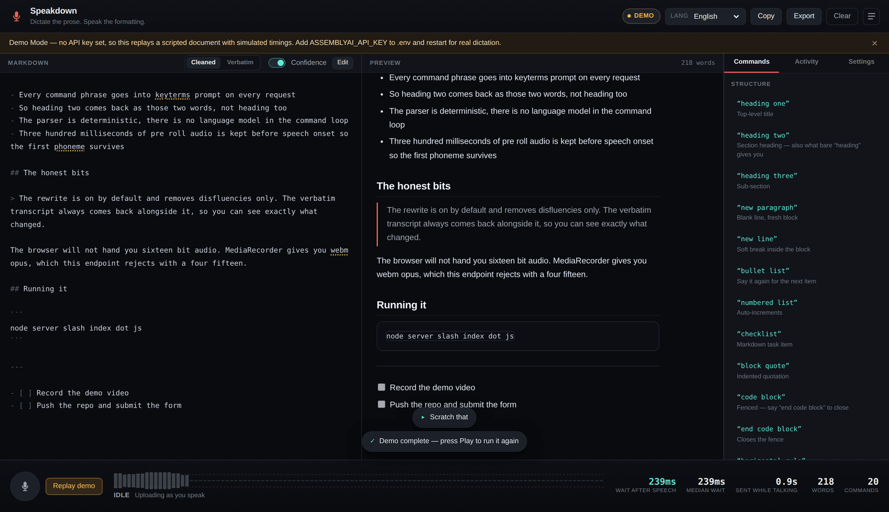

# Speakdown

**Dictate the prose. Speak the formatting.**

A voice-native markdown editor built on the [AssemblyAI Dictation API](https://www.assemblyai.com/docs/dictation).
You talk; structured markdown appears. Say "heading two" and you get a heading.
Say "bullet list" and you get a list. Say "scratch that" and the last thing you
said disappears. No keyboard, no toolbar, no mouse.



Built for AssemblyAI's Voice Hackathon Week, September 2026.

---

## Run it

```bash
git clone <this-repo> && cd speakdown
node server/index.js
```

That is the whole setup. **Zero npm dependencies** — no `npm install`, no
lockfile, no build step. Node 20 or newer is the only requirement.

Open <http://localhost:3000>. With no API key it starts in **Demo Mode** and
replays a scripted dictation with realistic timings, so you can see the entire
editor work without a key or a microphone. Press *Play demo*.

For real dictation:

```bash
cp .env.example .env     # then paste your key into ASSEMBLYAI_API_KEY
node server/index.js
```

`localhost` counts as a secure context, so the microphone prompt appears
normally — no HTTPS or tunnel needed.

```bash
npm test                 # 140 tests, no dependencies, ~1s
```

---

## The idea

Most integrations treat a dictation endpoint as "record a clip, upload it, wait".
This one does not, because of a line in the API docs that changes the whole
shape of the problem:

> The endpoint transcribes the audio it has while the rest is still arriving.

So Speakdown opens the HTTP request the *instant* the voice-activity detector
hears you start, and pushes PCM up as the microphone produces it. Transcription
happens **while you are still talking**. When you stop, the only thing left to
process is the tail.

```
  microphone
      │
      ▼
  AudioWorklet ──► Float32 frames on the audio render thread
      │
      ▼
  VAD detects speech onset ──────────► POST /api/dictate/start
      │                                  └─ upstream request opens NOW,
      ▼                                     config part already sent
  PCM every ~120 ms ─────────────────► POST /api/dictate/chunk  ×N
      │                                  └─ spliced into the open upstream body
      ▼
  VAD detects ~700 ms silence ───────► POST /api/dictate/end
                                         └─ body closes, transcript returns
      │
      ▼
  pick cleaned or verbatim ──► parse commands ──► document ──► markdown + preview
```

The dock shows **wait after speech** rather than total round trip, because that
is the number a person actually feels. Switch *Upload* to "Buffer, then send" in
Settings and watch it climb — that control is the A/B test for this whole idea.

### Why the browser doesn't stream directly

It can't. Chrome allows a streamed `fetch` request body only over HTTP/2; a
local dev server is HTTP/1.1, and the attempt fails with
`ERR_ALPN_NEGOTIATION_FAILED`. Firefox and Safari don't support request
streaming at all. (I tested this rather than assuming it.)

So the browser posts each ~120 ms of PCM as its own small request to the local
server, and the server feeds those frames into one long-lived upstream request.
The hop to localhost costs microseconds; the hop that matters — your machine to
AssemblyAI — is a genuine chunked upload. It works in every browser, needs no
TLS certificate, and keeps the dependency count at zero.

Raw PCM (`audio/pcm`) is used for the streaming path rather than WAV, because a
container header has a length field that can't be filled in until the clip is
finished. Without a container there is nothing to backfill, so frames leave the
moment they exist.

---

## Using the API properly

| Config field | What Speakdown sends | Why |
|---|---|---|
| `keyterms_prompt` | All 29 command phrases, every request | Without it, "heading two" transcribes as "heading too" and "block quote" as "black quote", and the parser never sees a command. This one parameter is the difference between a working product and a party trick. |
| `stt_prompt` | A description of the situation — someone dictating a document and speaking its formatting aloud | The docs are explicit that this field *describes* rather than instructs, so it is written that way. Pinning exact wording is `keyterms_prompt`'s job. |
| `llm_instruction` | **Omitted by default** | Omitting it keeps AssemblyAI's default cleanup, which removes disfluencies and leaves every other word exactly as spoken. That is precisely what a dictation editor wants. It's exposed in Settings for anyone who wants to replace that task. |

The response carries both texts: `text` is verbatim and never touched by the
LLM, `llm_response` is the rewrite. Speakdown keeps **every** transcript and the
**Cleaned / Verbatim** toggle rebuilds the whole document by replaying the log
through the same deterministic pipeline — so switching views is an exact
reconstruction, not an edit applied after the fact. The Activity panel word-diffs
the two and shows you exactly what the rewrite removed.

Rewrites are best-effort. A `null` `llm_response` with a non-null `llm_error`
is still a successful transcription, so Speakdown falls back to `text` and says
so in a toast rather than dropping the utterance.

Per-word confidences drive the **confidence heatmap**: words the model was
unsure about get a dotted amber underline in the source pane. It is a per-term
minimum across the document, not a per-occurrence record — that is the question
you actually want answered when proof-reading dictation.

---

## The command grammar

29 commands, parsed locally and deterministically. There is no LLM in this loop
on purpose: a spoken command must behave identically every single time, and an
extra inference step would add latency and non-determinism to the one part that
has to be predictable.

| Say | Get |
|---|---|
| "heading one" / "title" | `# Heading` |
| "heading two" / "subheading" / "heading" | `## Heading` |
| "heading three" | `### Heading` |
| "new paragraph" | Blank line, fresh block |
| "new line" | Soft break inside the block |
| "bullet list" / "next bullet" | `- item` |
| "numbered list" / "next number" | `1. item` (auto-increments) |
| "checklist" / "new task" | `- [ ] item` |
| "block quote" | `> quoted` |
| "code block" … "end code block" | Fenced block, captured verbatim |
| "divider" / "horizontal rule" | `---` |
| "bold that" / "italic that" / "code that" | Wraps what you just said |
| "strikethrough that" | `~~struck~~` |
| **"scratch that"** / "delete that" / "strike that" | Removes the last thing you said |
| "bring that back" | Re-applies what you scratched |
| "stop dictation" | Hands the mic back |

Spoken punctuation ("comma", "full stop", "open quote") is available but off by
default, because the model already punctuates prose and doubling up makes a mess.

### Where commands are allowed to match

Every phrase carries an anchor, and this took the most iteration:

- **anywhere** — "new paragraph", "scratch that". Distinctive enough to be safe,
  and people genuinely tack these on mid-flow.
- **boundary** — only at the start or end of an utterance. Lists, quotes, code
  fences, emphasis.
- **start** — only at the very start. Headings.

Headings earn the tightest anchor because of a sentence in this project's own
demo script: *"so heading two comes back as those two words, not heading too"*.
A naive parser turns that into a heading mid-sentence and shreds the paragraph.
Dictating a document *about* dictation is exactly when this bites.

Separately, short phrases that occur in ordinary prose — "heading", "quote",
"bold", "comma" — are marked strict, forcing at least boundary anchoring.
Without it, "the quote was misattributed to him" silently becomes a blockquote.

**"Strike that" means delete, not strikethrough.** That has been the dictation
convention for fifty years and getting it backwards would be destructive. Say
"strikethrough that" for `~~text~~`.

---

## Decisions worth explaining

**The browser will not give you 16-bit audio.** The endpoint takes `audio/wav`
or `audio/pcm` and rejects compressed formats with a 415. `MediaRecorder`, the
obvious API, produces webm/opus. So Speakdown captures raw Float32 frames through
an `AudioWorklet`, resamples to 16 kHz, and produces either raw PCM bytes or a
44-byte RIFF header itself. This is where a naive integration breaks, so it lives
in one small module with its own tests — including that out-of-range samples
clamp rather than wrap, which is an easy way to turn quiet speech into static.

**Streaming needs a resampler that remembers.** 128-sample frames at 48 kHz do
not divide evenly by three, so a per-frame block-average silently drops up to two
samples every frame. At 8 ms a frame that is a steady, accumulating drift over a
long utterance. `StreamingResampler` carries the remainder across calls, and a
test asserts it produces bit-identical output to the one-shot resampler.

**Audio arrives before the session exists.** Opening the upstream request is a
round trip, however short, and the microphone does not wait for it. Frames
captured in that window are buffered and flushed the moment the session id lands.
Dropping them would clip the first word of every utterance and undo the whole
point of the pre-roll.

**300 ms of pre-roll.** The segmenter retains audio from *before* speech was
detected and sends it as the first chunk. Without it every utterance loses its
first consonant and "bullet list" arrives as "ullet list". The VAD also uses an
adaptive noise floor (a fixed threshold works in a quiet room and fails next to a
laptop fan) and hysteresis, so a dip mid-word does not split one utterance in two.
The dock meter draws the live threshold, which makes the segmenter's decisions
visible when a room is behaving badly.

**Utterances are applied in spoken order.** They overlap — you start the next
sentence before the last transcript returns — so a sequence number and a pending
map keep the document in the order the words were said. Without it a fast short
clip overtakes a slow long one and the document comes out scrambled.

**One undo snapshot per utterance.** "Scratch that" should undo the last thing
you *said*, regardless of how many commands that utterance contained. A pure-edit
utterance deliberately does not snapshot first — otherwise the undo pops the
snapshot just pushed and nothing appears to happen.

**404 means a bad key, not a bad URL.** This endpoint returns 404 for an invalid
API key. Reporting that as "not found" would send you hunting for a wrong URL
instead of a wrong key, so it is mapped to a fatal auth error that stops
dictation and says so plainly.

**The API key never reaches the browser.** The Node proxy holds it, assembles the
multipart body by hand — `config` first, then `audio`, because the server cannot
start transcribing without the config and rejects the wrong order with a 400 —
and drops any config field the docs don't document rather than forwarding it.

---

## Notes on the Dictation API

Written up honestly, including what I got wrong.

**What is genuinely good.** The streaming upload is the standout: one ordinary
HTTP request that happens to transcribe as it reads, with no WebSocket, no
session lifecycle, and no partial-result reconciliation. It removes an entire
class of bugs that a streaming integration normally has to handle, and the
latency win is real and visible. `keyterms_prompt` made a large, obvious
difference to command recognition; it is the reason this project works at all.
Returning both `text` and `llm_response` rather than only the rewrite is the
right call — it makes the rewrite auditable, which is what let me build the
Cleaned/Verbatim toggle at all. And splitting `request_time_ms` from
`sync_time_ms` means you can see the rewrite's cost separately from
transcription without instrumenting anything.

**Feedback:**

1. *`/v1/transcribe/live` is hard to find from outside the docs page.* Searching
   for the Dictation API surfaces the Sync STT product first, whose endpoint
   (`sync.assemblyai.com/transcribe`) has a similar shape and a similar
   `keyterms_prompt`. I built an entire first version against the wrong service
   before catching it. The docs note that `/v1/transcribe/stream` still reaches
   the same handler and there is no unversioned alias — that is exactly the
   right kind of note, and more cross-linking from the Sync docs saying "if you
   want dictation, you want this other host" would have saved me a day.

2. *The "uploading while recording" section deserves to be much louder.* It is
   the single most valuable property of this API and it is three quarters of the
   way down the page, under a heading that reads like an optional optimisation.
   It isn't — it changes the architecture of anything built on it.

3. *A browser-side note would help.* The natural way to stream from a browser is
   `fetch` with a `ReadableStream` body, which silently requires HTTP/2 and is
   Chrome-only. Worth one line in the docs, since "call it over HTTP" implies a
   browser can do this directly and it can't without a proxy in front.

4. *One small inconsistency:* the hackathon announcement says 18 supported
   languages; the docs list 19 codes (en, es, de, fr, it, pt, tr, nl, sv, no, da,
   fi, hi, vi, ar, he, ja, ur, zh).

---

## Limitations

Stated plainly, because a demo that hides these is not much use.

The voice command grammar is English-only. Transcription works in all 19
supported languages and you can dictate prose in any of them, but the command
phrases are English words. Localising is a per-language table, not a rewrite, but
it is not done.

Nested structure is not supported. The document model is a flat list of blocks,
because every nesting scheme I tried made spoken commands ambiguous — a bullet
list inside a quote inside a list gives "bullet list" three meanings. Consecutive
list items are grouped at serialisation time, which produces correct markdown
without the model needing a tree.

The confidence heatmap is per-term, not per-occurrence. If a word appears three
times and the model was unsure once, all three are underlined.

Streaming saves less on very short utterances than on long ones — there is
simply less uploaded-but-unprocessed audio to overlap with. The docs say this
too. On two-second clips the win is small; on fifteen-second ones it is obvious.

Hand-editing the source pane discards the transcript log, so the Cleaned/Verbatim
toggle stops working for that document. The alternative was letting a later
toggle silently revert your edit, which is worse.

Utterance segmentation is tuned for a reasonably quiet room with a close
microphone. It degrades in a noisy open-plan office — a limitation of
energy-based voice activity detection, not of the API.

---

## Layout

```
server/
  index.js              HTTP server, static files, streaming session bridge
  dictation-api.js      The Dictation API client — multipart assembly, errors
public/
  index.html            The editor shell
  css/app.css           All styling
  js/
    app.js              Wiring, utterance lifecycle, ordered application, meter
    recorder.js         Microphone capture and voice-activity segmentation
    wav.js              Resampling, Int16 conversion, PCM bytes, RIFF encoding
    capture-worklet.js  AudioWorklet processor (audio render thread)
    dictation.js        Live client + per-utterance handles + scripted demo
    commands.js         The voice command grammar and keyterm vocabulary
    pipeline.js         Transcript -> document (DOM-free, fully tested)
    doc.js              Block document model, undo, markdown serialisation
    text.js             Filler removal, fragment joining, emphasis wrapping
    markdown.js         Markdown renderer and source highlighter
test/                   140 tests across all of the above
```

The pipeline lives apart from `app.js` deliberately: it holds all the interesting
behaviour, and keeping it free of DOM access means the test suite exercises the
real code rather than a reimplementation. The server tests run the real client
against a stand-in upstream that records exactly what it received, so the
multipart ordering and the streaming behaviour are asserted rather than assumed.

---

## Licence

MIT. See [LICENSE](LICENSE).
